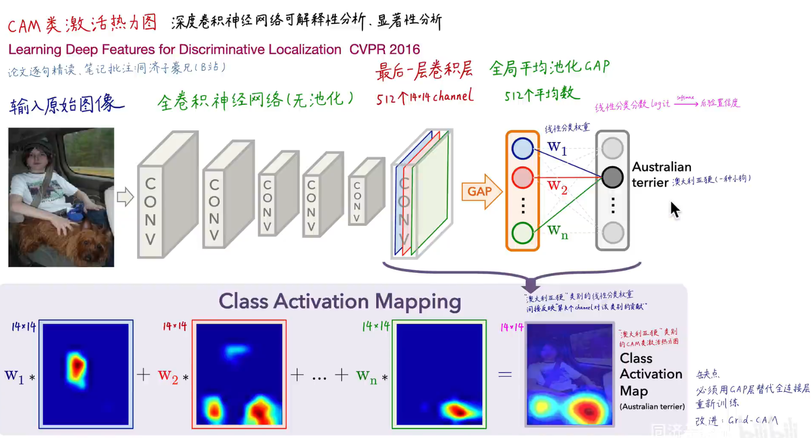
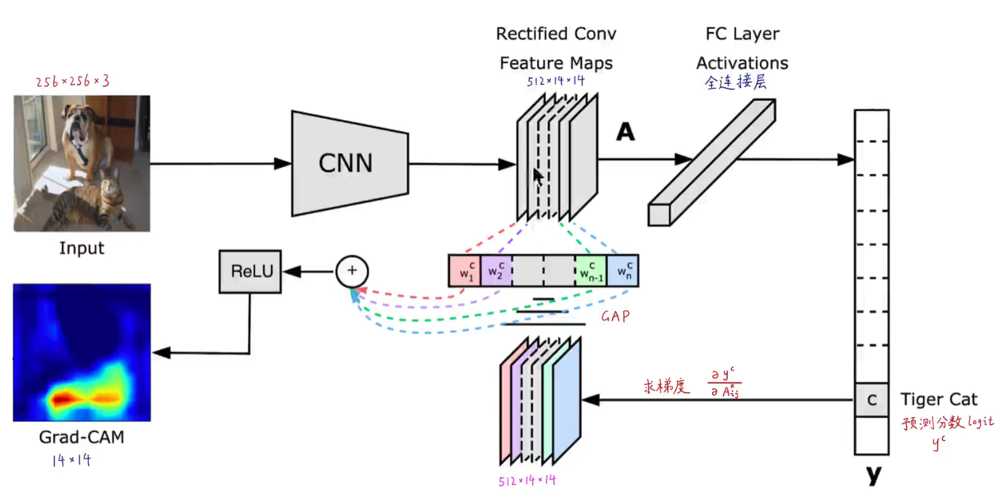
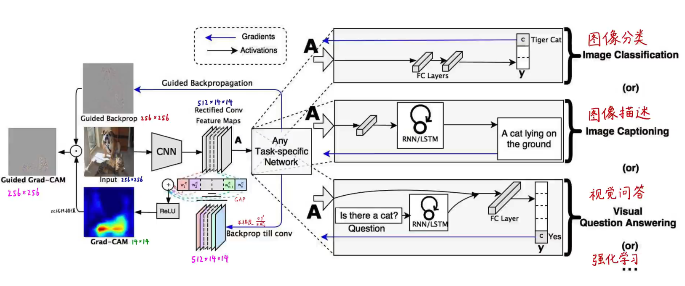
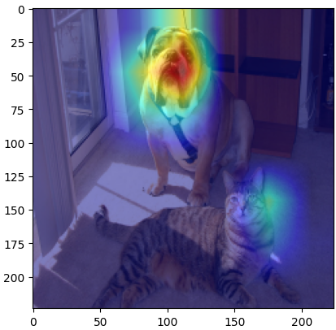
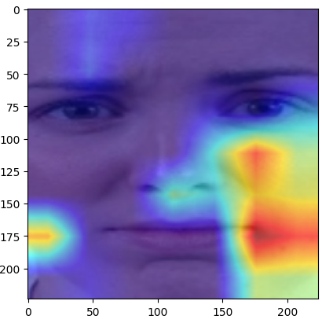

## Using Grad Cam

参考同济子豪兄：https://www.bilibili.com/video/BV1PD4y1B77q/?spm_id_from=333.337.search-card.all.click&vd_source=16a2fa3709580d2463346223fc1f67b1

### - Cam

**CAM利用模型的Global AvgPool层的feature map和全连接层的参数进行加权得到对应类别的热力图。**

**缺点是：模型必须有Global AvgPool层，相当于限制了模型最后几层的架构。**

### - Grad Cam

**为了弥补Cam的缺陷，Grad-Cam不是直接使用最后一层全连接层的权重，而是使用对梯度进行求导来计算某个层对某个logit的贡献值，这个和Cam直接使用权重计算的数学原理是一样的。**

**基于对梯度求导的方法使得Grad-Cam可以用在各种模型上而不仅仅是分类模型。**

### - 在Resnet上使用Cam

案例代码见**example_resnet.ipynb**

### -在CDNet上使用Cam

案例代码见**example_cdnet.ipynb**

